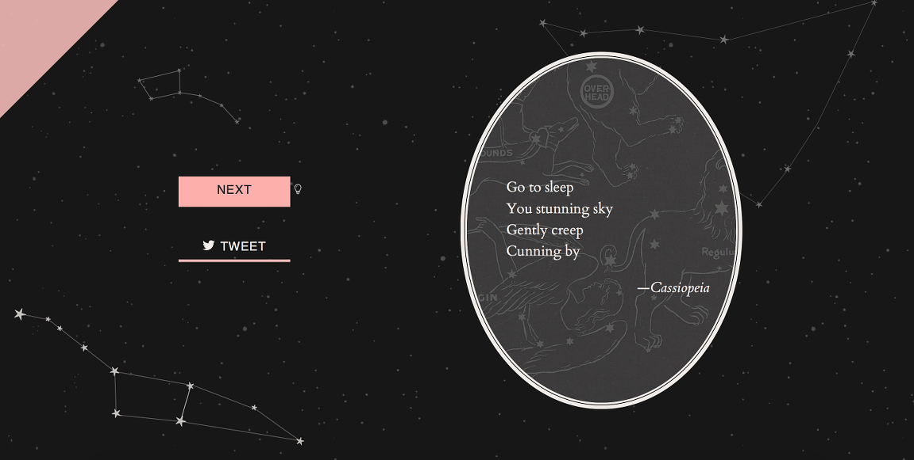
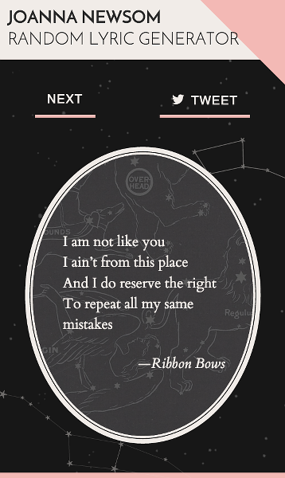
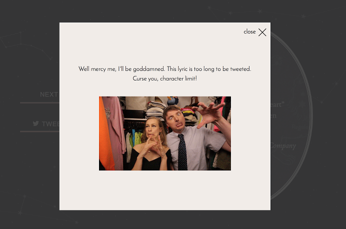

# Joanna Newsom Random Lyric Generator

As a project for [Free Code Camp](http://freecodecamp.com), I created a random lyric generator, featuring some of my favorite lyrics by my favorite musician, Joanna Newsom.  

This was my first complete project, so as I become more comfortable with CSS and JavaScript, I'm sure I'll find many ways in which it can be improved.

## Design

**MOBILE VIEW:**

 

The design was inspired by the many references to constellations in Joanna's lyrics. I created SVG outlines of Ursa Major and Ursa Minor, as well as Capricorn. The background for the lyric container is taken from a vintage star map of Cassiopeia. 

One of my favorite features is the error modal that appears when you try to Tweet a lyric that exceeds 140 characters, with a reference to the song *Baby Birch*:

## To-Do

As I become more comfortable with web development, I'd like to:

- Make the site more accessible
- Optimize all of my assets
- Improve the code quality
- Add the ability to access the last lyric, not just the next one
- Add more lyrics
- Randomly animate the stars in each constellation